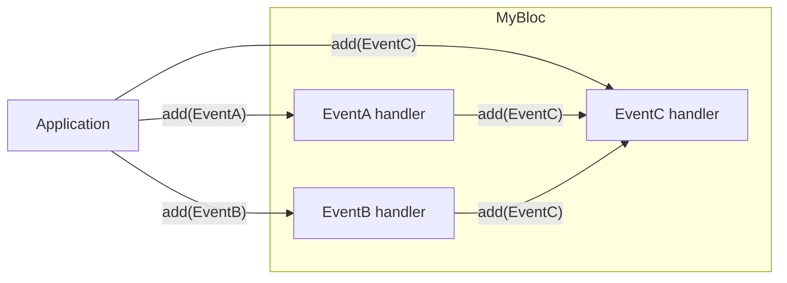

{{
  {
    "@type": "blog-post-metadata",
    "title": "Testing internal BLoC events",
    "author": {
      "name": "Alejandro Santiago",
      "avatar": "https://avatars.githubusercontent.com/u/44524995?v=4"
    },
    "subtitle": "Verifying internal events with `package:bloc_test`.",
    "updatedAt": "2025-11-22",
    "estimatedReadingTime": 7,
    "tags": ["Flutter", "BLoC"]
  }
}}

In BLoC (`package:bloc`), events are usually added outside of the `Bloc` subclass, we denote these as _external events_. However, events can also be added within the `Bloc` subclass, we denote these as _internal events_.

In some select cases it may make sense for events to be added internally[^adding_events_within_a_bloc] (Angelov, 2022), when so happens testing with `package:bloc_test` might seem coumbersome, but it's not.

## Illustrated example

Consider the scenario where you have three events (`EventA`, `EventB` and `EventC`).

`EventA`, `EventB` and `EventC` are all _external events_, but `EventC` is also an _internal event_. `EventC` is added from three sources:

To verify `EventC` is added, we can use `Bloc.observer`[^observing_a_bloc] to capture events.

{{
  {
    "@type": "code-block",
    "path": "example/test/example1_test.dart",
    "alias": "foo_bloc_test.dart"
  }
}}

[^adding_events_within_a_bloc]: As outlined in bloclibrary.dev documentation ["Adding Events within a Bloc"](https://bloclibrary.dev/faqs/#adding-events-within-a-bloc), originally written by Felix Angelov at Pull Request [#3633](https://github.com/felangel/bloc/pull/3633); accessed November 2025.
[^observing_a_bloc]: As outlined in bloclibrary.dev documentation ["Observing a Bloc"](https://bloclibrary.dev/bloc-concepts/#observing-a-bloc), originally written by Felix Angelov at Pull Request [#1441](https://github.com/felangel/bloc/pull/1441); accessed November 2025.