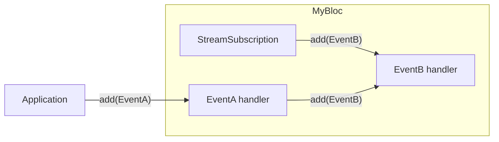

{{
  {
    "@type": "blog-post-metadata",
    "title": "Verifying internally added BLoC events",
    "author": {
      "name": "Alejandro Santiago",
      "avatar": "https://avatars.githubusercontent.com/u/44524995?v=4"
    },
    "subtitle": "Verifying internally added events with the bloc_test package.",
    "updatedAt": "2025-11-22",
    "estimatedReadingTime": 3,
    "tags": ["Flutter", "Dart", "BLoC"]
  }
}}

In BLoC (`package:bloc`), events are usually added outside of the `Bloc` subclass; I denote these as _externally added events_. However, events can also be added within the `Bloc` subclass; I denote these as _internally added events_.

> In some select cases it may make sense for events to be added internally. (Angelov, 2022)[^adding_events_within_a_bloc]

Since commit [d038a35](https://github.com/felangel/bloc/commit/d038a35460877d39b2af7466bb92a41d58d37e9) [^bloc_test_commit] merged in February 2026, you can now easily verify _internally added events_ using [`Bloc.observer`](https://bloclibrary.dev/bloc-concepts/#observing-a-bloc)[^observing_a_bloc].

## Illustrated example

Consider the scenario where you have two events: `EventA` and `EventB`.

`EventB` is internally added from `EventA` and from a stream `MyBloc` internally subscribes to:

### Verification

You can now easily verify `EventB` is added by defining a `Bloc.observer` to capture events:

{{
  {
    "@type": "code-block",
    "path": "example/test/my_bloc_test.dart",
    "sourceUrl": "https://github.com/alestiago/alestiago/tree/master/docs/blogs/20251122-testing-internal-bloc-events/example/test/my_bloc_test.dart",
    "alias": "my_bloc_test.dart",
    "lines": [{"from":9,"to":17}]
  }
}}

Then, verifying the events:

{{
  {
    "@type": "code-block",
    "path": "example/test/my_bloc_test.dart",
    "sourceUrl": "https://github.com/alestiago/alestiago/tree/master/docs/blogs/20251122-testing-internal-bloc-events/example/test/my_bloc_test.dart",
    "alias": "my_bloc_test.dart",
    "lines": [{"from":30,"to":61}]
  }
}}

## Further reading

If you want to learn more about the advantages and disadvantages of using internally added events refer to the ["Adding Events within a Bloc"](https://bloclibrary.dev/faqs/#adding-events-within-a-bloc)[^adding_events_within_a_bloc] in the Bloc library documentation.

Additionally, the complete example source code is available in my [GitHub](https://github.com/alestiago/alestiago/tree/master/docs/blogs/20251122-testing-internal-bloc-events/example/)[^example_code].

[^observing_a_bloc]: Angelov, F. ([2020](https://github.com/felangel/bloc/commit/9918078fe91b4c2961b17070c985700b293ba616)). Observing a Bloc. Bloc Library. Retrieved November 2025, from https://bloclibrary.dev/bloc-concepts/#observing-a-bloc
[^adding_events_within_a_bloc]: Angelov, F. ([2022](https://github.com/felangel/bloc/pull/3633)). Adding events within a Bloc. Bloc Library. Retrieved November 2025, from https://bloclibrary.dev/faqs/#adding-events-within-a-bloc
[^bloc_test_commit]: Santiago, A. (2026, February). Propagate lifecycle events to registered BlocObserver (#4688). GitHub. https://github.com/felangel/bloc/commit/d038a35460877d39b2af7466bb92a41d58d37e9f
[^example_code]: Santiago, A. (2026, February). Verifying internally added BLoC events - Example code. GitHub. Retrieved February 2026, from https://github.com/alestiago/alestiago/tree/master/docs/blogs/20251122-testing-internal-bloc-events/example/
